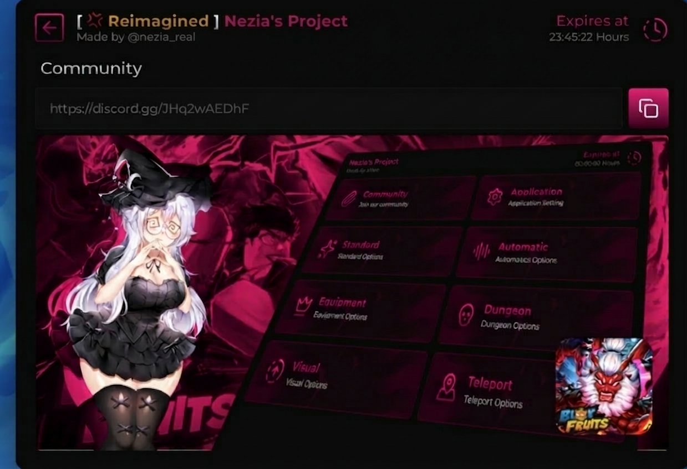

# UiLibrary
<p align="center">
  
</p>
Reimagined Ui Library is a simple Roblox UI library that allows developers to easily create windows, tabs, and UI components with a clean API.

---

# Installation

Load the library using `loadstring`.

```lua
local Library = loadstring(game:HttpGet("https://raw.githubusercontent.com/NeziaReal/BloxFruits/refs/heads/main/UiLibrary/Library.lua"))()
```

---

# Basic Example

```lua
local Library = loadstring(game:HttpGet("https://raw.githubusercontent.com/NeziaReal/BloxFruits/refs/heads/main/UiLibrary/Library.lua"))()

local Window = Library:Window({
    Title = "Sigma Ui",  -- Your window title
    SubTitle = "Made by nezia"  -- Your subtitle
})

local Tab = Window:CreateTab("Main")

Tab:CreateButton({
    Name = "Print Hello",
    Callback = function()
        print("Hello")
    end
})
```

---

# API Documentation

## CreateWindow

Creates the main UI window.

```lua
local Window = Library:CreateWindow({
    Name = "Window Name"
})
```

### Options

| Property | Type | Description |
|--------|--------|--------|
| Name | string | Title of the UI window |

---

# Tabs

## CreateTab

Creates a new tab inside the window.

```lua
local Tab = Window:CreateTab("Main")
```

### Parameters

| Parameter | Type | Description |
|--------|--------|--------|
| Name | string | Name of the tab |

---

# Components

## Button

Creates a clickable button.

```lua
Tab:CreateButton({
    Name = "Button Name",
    Callback = function()
        print("Clicked")
    end
})
```

### Options

| Property | Type | Description |
|--------|--------|--------|
| Name | string | Button text |
| Callback | function | Function executed when clicked |

---

## Toggle

Creates a toggle switch.

```lua
Tab:CreateToggle({
    Name = "Enable Feature",
    Default = false,
    Callback = function(state)
        print(state)
    end
})
```

### Options

| Property | Type | Description |
|--------|--------|--------|
| Name | string | Toggle label |
| Default | boolean | Default state |
| Callback | function | Called when toggled |

---

## Slider

Creates a value slider.

```lua
Tab:CreateSlider({
    Name = "Speed",
    Min = 0,
    Max = 100,
    Default = 50,
    Callback = function(value)
        print(value)
    end
})
```

### Options

| Property | Type | Description |
|--------|--------|--------|
| Min | number | Minimum value |
| Max | number | Maximum value |
| Default | number | Starting value |
| Callback | function | Triggered when value changes |

---

## Dropdown

Creates a dropdown selector.

```lua
Tab:CreateDropdown({
    Name = "Select Option",
    Options = {"A","B","C"},
    Callback = function(option)
        print(option)
    end
})
```

### Options

| Property | Type | Description |
|--------|--------|--------|
| Options | table | List of selectable options |
| Callback | function | Runs when an option is selected |

---

## Label

Creates a text label.

```lua
Tab:CreateLabel("This is a label")
```

---

# Full Example

```lua
-- Load the library
local Library = loadstring(game:HttpGet("https://raw.githubusercontent.com/NeziaReal/BloxFruits/refs/heads/main/UiLibrary/Library.lua"))() -- Replace with actual path

-- Create the main window
local Window = Library:Window({
    Title = "Nez's Project",  -- Your window title
    SubTitle = "Made by Nezia"  -- Your subtitle
})

-- Create a new page
local MainPage = Window:NewPage({
    Title = "Main",  -- Page title
    Desc = "Main Features",  -- Page description
    Icon = 127194456372995  -- Icon asset ID (or use your own)
})

-- Create another page
local SettingsPage = Window:NewPage({
    Title = "Settings",
    Desc = "Configuration Options",
    Icon = 127194456372995
})

-- Add a section to MainPage
MainPage:Section("Player Settings")

-- Add a toggle
local ToggleExample = MainPage:Toggle({
    Title = "Auto Farm",
    Desc = "Automatically collect resources",
    Value = false,  -- Default value
    Callback = function(value)
        print("Auto Farm is now:", value)
        -- Add your auto farm logic here
        if value then
            -- Start auto farm
        else
            -- Stop auto farm
        end
    end
})

-- Add a slider
MainPage:Slider({
    Title = "Walk Speed",
    Min = 16,
    Max = 100,
    Rounding = 1,  -- Round to 1 decimal place
    Value = 16,  -- Default value
    Callback = function(value)
        print("Speed set to:", value)
        game.Players.LocalPlayer.Character.Humanoid.WalkSpeed = value
    end
})

-- Add a button
MainPage:Button({
    Title = "Teleport to Spawn",
    Desc = "Teleports you to the spawn location",
    Text = "TP",  -- Button text
    Callback = function()
        print("Teleporting to spawn...")
        -- Add teleport logic here
        game.Players.LocalPlayer.Character.HumanoidRootPart.CFrame = CFrame.new(0, 50, 0)
    end
})

-- Add a right label (displays text on the right side)
MainPage:RightLabel({
    Title = "Player Info",
    Desc = "Current player statistics",
    Right = "Online"  -- Text displayed on the right
})

-- Add an input box
local InputBox = MainPage:Input({
    Value = "Default Text",
    Callback = function(text)
        print("User entered:", text)
    end
})

-- Add a dropdown
MainPage:Dropdown({
    Title = "Select Weapon",
    List = {"Sword", "Gun", "Bow", "Axe"},
    Value = "Sword",  -- Default selected value
    Callback = function(selected)
        print("Selected weapon:", selected)
        -- Add weapon selection logic here
    end
})

-- Multi-select dropdown example
MainPage:Dropdown({
    Title = "Select Buffs",
    List = {"Speed", "Strength", "Jump", "Defense"},
    Value = {"Speed", "Strength"},  -- Multiple default selections
    Callback = function(selected)
        print("Selected buffs:", table.concat(selected, ", "))
        -- Add buff application logic here
    end
})

-- Add a paragraph with icon
MainPage:Paragraph({
    Title = "Welcome Message",
    Desc = "Hello! Welcome to the script. Use the toggles to enable features.",
    Image = 127194456372995  -- Icon to display
})

-- Add a banner image
MainPage:Banner(125411502674016)  -- Banner image asset ID

-- Settings page elements
SettingsPage:Section("Interface Settings")

-- Add a toggle for dark mode
SettingsPage:Toggle({
    Title = "Dark Mode",
    Desc = "Toggle dark theme",
    Value = true,
    Callback = function(value)
        print("Dark mode:", value)
        -- Add theme switching logic here
    end
})

-- Update the expires time (optional)
Library:SetTimeValue("23:59:59 Hours")

-- You can also update toggle values later
task.wait(5)
ToggleExample.Value = true  -- This will automatically trigger the callback

-- You can update dropdown values
-- For the dropdown example, you would need to store the dropdown object to update it
```

---

# License

MIT License
